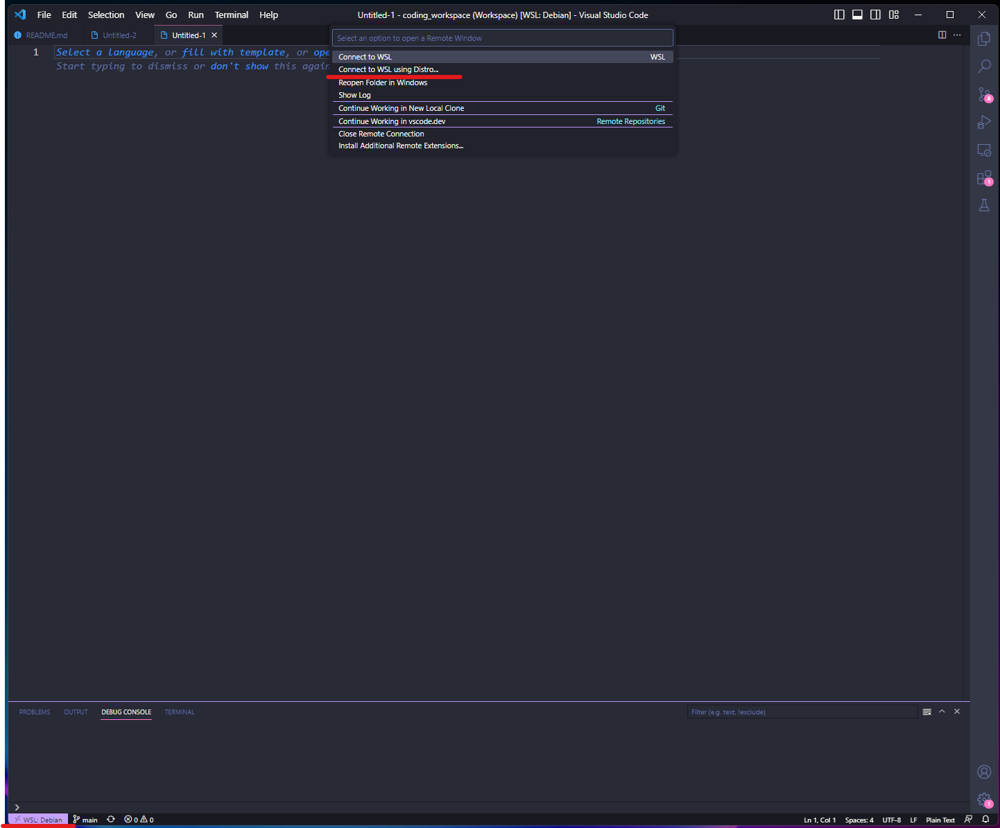

# Configure dev environment using WSL in Windows and launch it using Visual Studio Code

## Step 1: Install WSL and the desired Linux distro (I always use Debian)
Open Powershell as Administrator and run the following commands:

Installing WSL:
```
wsl --install
```

If you want to first list the available distros, you can run this command:
```
wsl --list --online
```

Now, install the distro
```
wsl --install -d <Distribution Name> 
```

If you want to setup a distro as the default distro for WSL, run this command:
```
wsl --setdefault <DistributionName>
```

For more information you can check the documentation [here](https://learn.microsoft.com/en-us/windows/wsl/install).

## Step 2: Connect Visual Studio Code to the WSL distro
Click on the left bottom corner in Visual Studio Code, and in the prompt box select:
*New WSL Window* then, select the distro installed (all the wsl distros should appear here).



This will open a new window and the console will be in the WSL. So you can start developing and installing everything you need for Linux.

## Step 3: Install and set up Git in WSL
Enter the console and run the following commands:

```
sudo apt update
sudo apt install git
git config --global user.name "Name Lastname"
git config --global user.email "yourmail@gmail.com"
git config --list
git clone https://myrepo.github.com
git checkout yourbranch
```

## Step 4: How to manage the project folders within wsl
To open the wsl folders using the windows explorer (in case you dont want to use the console), just enter in the wsl console this command: 
```
explorer.exe . 
```
It will open a new Explorer already in the wsl folder from within the command was runned. 

You can also use the command: \\wsl$\

For more information you can check the following [link](https://learn.microsoft.com/en-us/windows/wsl/setup/environment#set-up-your-linux-username-and-password).

## Step 5: Install python and jupyter notebooks
Run the following commands on the wsl console on your root user folder in WSL:
Install dependencies to compile python source code:
```
sudo apt-get install wget build-essential libreadline-gplv2-dev libncursesw5-dev libssl-dev libsqlite3-dev tk-dev libgdbm-dev libc6-dev libbz2-dev libffi-dev zlib1g-dev liblzma-dev -y
```
Get the last python code (you can search the last version [here](https://www.python.org/downloads/source/))
```
wget https://www.python.org/ftp/python/3.9.6/Python-3.9.6.tgz
```
Extract the file
```
tar xzf Python-3.9.6.tgz
```
Compile the code
```
cd Python-3.9.6 && ./configure --enable-optimizations
```
Install Python
```
sudo make altinstall
```
Check name of the python executable
```
ls /usr/local/bin/python*
```
Set new Python executable as default
```
sudo update-alternatives --install /usr/bin/python python /usr/local/bin/python3.9 1
```
Install pip
```
python -m pip install --upgrade pip
```
Check pip executable
```
ls /usr/local/bin/pip*
```
Set new pip as default
```
sudo update-alternatives --install /usr/bin/pip pip /usr/local/bin/pip3.9 1
```
Check python and pip versions
```
python -V && pip -V
```

## Step 6: Create a python virtual env
To avoid libraries conflicts, is recommended to install a python env, you can do it running this command:
```
python -m pip install --user virtualenv
python -m virtualenv myenv
```
Here the env name is "myenv",

Activate virtual env enter to the folder where the env was installed.
```
source myenv/bin/activate 
```

## Step 7: Set an environment variable for easier access to your project folder
Create the env variable:
```
export PROJECT_PATH="$HOME/folder/project"
```
Enter the project folder:
```
cd $PROJECT_PATH
```

## Step 8: OPTIONAL - Install any library that you may need
If you want the basics for machine learning for example, install the following:
```
python -m pip install -U jupyter matplotlib numpy pandas scipy scikit-learn
```
If you create the virtual env of the Step 6, you need to register the env in Jupyter like this:
```
python -m ipykernel install --user --name=python
```
